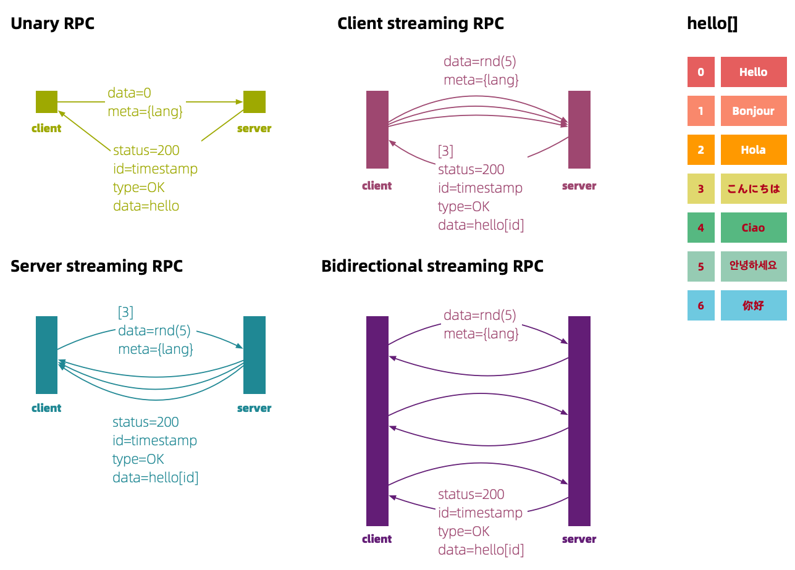
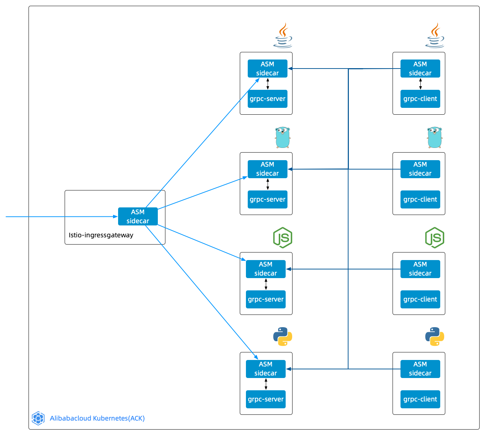

## hello-servicemesh-grpc
### GRPC Diagram

### Kube Topology

### Mesh Management
#### v1 100%

#### api 100%

### Proto3
- [proto](proto)

### Service
- [hello-grpc-java](hello-grpc-java)
- [hello-grpc-go](hello-grpc-go)
- [hello-grpc-nodejs](hello-grpc-nodejs)
- [hell-grpc-python ](hell-grpc-python )

### Cross Access Test
- [cross](cross)

### ServiceMesh
- [docker](docker)
    - registry.cn-beijing.aliyuncs.com/asm_repo/grpc_server_java:1.0.0
    - registry.cn-beijing.aliyuncs.com/asm_repo/grpc_client_java:1.0.0
    - registry.cn-beijing.aliyuncs.com/asm_repo/grpc_server_go:1.0.0
    - registry.cn-beijing.aliyuncs.com/asm_repo/grpc_client_go:1.0.0
    - registry.cn-beijing.aliyuncs.com/asm_repo/grpc_server_node:1.0.0
    - registry.cn-beijing.aliyuncs.com/asm_repo/grpc_client_node:1.0.0
    - registry.cn-beijing.aliyuncs.com/asm_repo/grpc_server_python:1.0.0
    - registry.cn-beijing.aliyuncs.com/asm_repo/grpc_client_python:1.0.0
- [kube](kube)
- [mesh](mesh)
